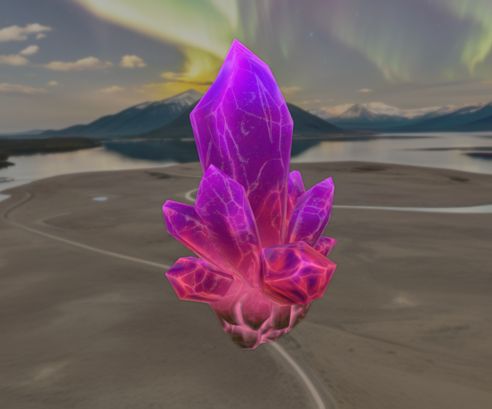
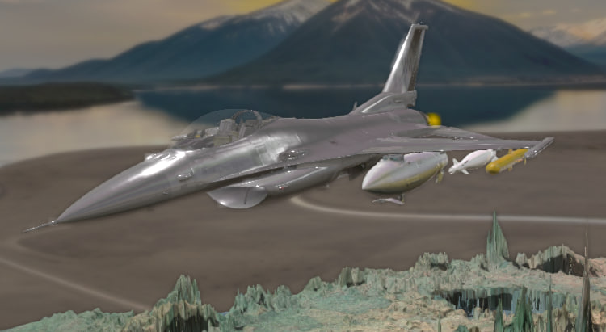

# TourmalineEngine V0.0.3 (Beta)

  
   
  <strong>Engine Render</strong>

Greetings, this is a follow-up project to my previous endeavour (TanksProj)
This Framework aims at being an easy and intuitive tool for 3D graphics and physical simulation.

Possible usages include:
3D games, CAD, physical simulation and visualization.

My engine is strictly divided into the following modules:

- ## Tourmaline Graphics
1. It is based on the OpenGL API [4.6, GLSL 460]
2. PBR
3. ShadowMapping
4. ImGUI UI

- ## Tourmaline Physics
1. RigidBody physics
2. Plane Physics 
3. Collision [ Future ]

- ## Tourmaline IO
**Supported as of now:**
1. Mouse 
2. Keyboard

- ## Tourmaline Sound (Future)
1. OpenAL

  
   
  <em>Flight Simulator Preview</em>

This project uses the following open-source libraries and technologies:

### 📌 Dependencies and Attribution

This project uses the following open-source libraries and technologies:

- **LWJGL** (Lightweight Java Game Library)  
  License: [LWJGL License](https://www.lwjgl.org/license)

- **JOML** (Java OpenGL Math Library)  
  License: [JOML License](https://github.com/JOML-CI/JOML/blob/main/LICENSE)

- **OpenGL** (by the Khronos Group)  
  License: [OpenGL License](https://github.com/TheCherno/OpenGL/blob/master/LICENSE)

- **Additional used material can be found in my thesis on the drive**

All trademarks, logos, and brand names are the property of their respective owners. 
No ownership is claimed over the libraries or technologies listed above.

### 📌 Tested Operating Systems

| OS           | Version  | Status     |
|--------------|----------|------------|
| 🪟 Windows   | 11       | ✅ Tested  |
| 🐧 Ubuntu    | 24.10    | ✅ Tested  |

### 📌 Supported Java Versions

| Java Version | Status                          |
|--------------|---------------------------------|
| ☕ Java 8    | ❌ Not Supported                 |
| ☕ Java 11   | ❌ Not Supported                 |
| ☕ Java 17   | ❌ Not Supported                 |
| ☕ Java 21   | ✅ Currently Supported (Preview) |
| ☕ Java 22   | ✅ Supported (Not fully tested)  |

## License Text

Copyright (c) 2025 Kokhanchuk Yurii

Permission is hereby granted to any person obtaining a copy
of this software and associated documentation to deal with some restrictions. 
These restrictions include selling, sublicense, copying, modifying and using 
in your projects without mentioning the creator and text of this license. 

Commercially successful software that implements Tormaline(TM) Framework/Game Engine
MUST pay a fee of 5.0% of gross annual revenue.

"Commercially successful software" is defined as software 
or software components that produce more than 50.000 EUR gross annual revenue 